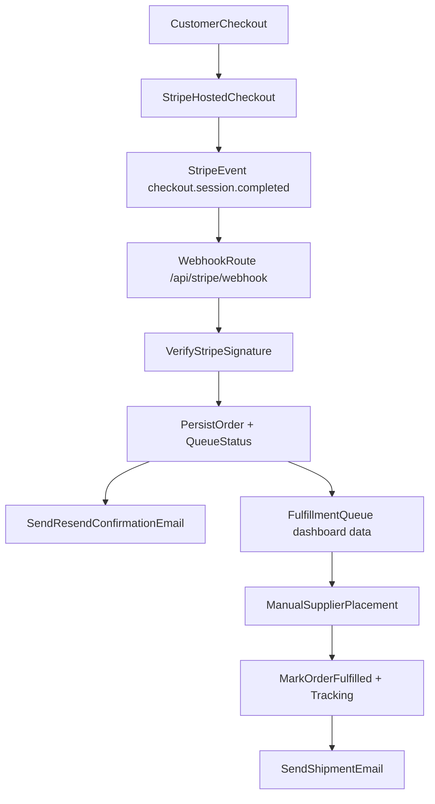

# Checkout Confirmation + Fulfillment Queue Plan

## Current Baseline

- Checkout creation is in `[C:\Users\khant\Projects\dice-website\app\actions\stripe.ts](C:\Users\khant\Projects\dice-website\app\actions\stripe.ts)` and already redirects to Stripe with `success_url`/`cancel_url`.
- Success UI exists in `[C:\Users\khant\Projects\dice-website\app\checkout\page.tsx](C:\Users\khant\Projects\dice-website\app\checkout\page.tsx)`, but there is no server-side order persistence.
- There is currently no API route under `/api` for Stripe webhook processing.

## Architecture (Target)

## Implementation Plan

- Add webhook endpoint in `[C:\Users\khant\Projects\dice-website\app\api\stripe\webhook\route.ts](C:\Users\khant\Projects\dice-website\app\api\stripe\webhook\route.ts)` to verify `stripe-signature`, handle `checkout.session.completed`, and ignore non-target events.
- Add Convex as the primary database with schema + indexes for orders and processed webhook events, then persist order records from webhook processing.
- Create Convex server functions for:
  - creating order records (order ID, Stripe session/payment IDs, customer email, shipping address, line items, totals, queue status, timestamps)
  - storing processed Stripe `event.id` values to enforce idempotency
  - listing pending fulfillment orders and updating fulfillment status/tracking
- Extend checkout session creation in `[C:\Users\khant\Projects\dice-website\app\actions\stripe.ts](C:\Users\khant\Projects\dice-website\app\actions\stripe.ts)` with metadata (product IDs, quantities, cart total hash/version) so webhook processing can reconstruct order safely.
- Integrate Resend for transactional email sending from server-only helper (e.g. `lib/email.ts`) and trigger customer confirmation email immediately after successful webhook persistence.
- Add a basic admin-only queue page (protected via env token gate for v1) to list pending orders and mark fulfilled with optional tracking number.
- Add second email template for fulfillment update (tracking included) sent when queue item is marked fulfilled.
- Add idempotency protections in webhook flow using Convex `processedEvents` lookups before order/email writes.

## Convex Data Model (Exact v1)

- Add schema in `[C:\Users\khant\Projects\dice-website\convex\schema.ts](C:\Users\khant\Projects\dice-website\convex\schema.ts)` with:
  - `orders`
    - `orderNumber` (string, human-friendly like `ARC-20260302-0001`)
    - `stripeSessionId` (string, unique)
    - `stripePaymentIntentId` (optional string)
    - `stripeEventId` (string)
    - `customerEmail` (string)
    - `customerName` (optional string)
    - `shippingAddress` (object: line1, line2, city, state, postalCode, country)
    - `lineItems` (array of objects: productId, productName, quantity, unitAmount, currency)
    - `subtotalAmount` (number)
    - `discountAmount` (number)
    - `shippingAmount` (number)
    - `totalAmount` (number)
    - `currency` (string)
    - `couponCode` (optional string)
    - `fulfillmentStatus` (union: `pending_fulfillment` | `fulfilled` | `cancelled`)
    - `trackingNumber` (optional string)
    - `supplierOrderRef` (optional string)
    - `createdAt` (number)
    - `updatedAt` (number)
  - `processedEvents`
    - `eventId` (string, unique)
    - `eventType` (string)
    - `processedAt` (number)
    - `orderId` (optional Id of `orders`)
- Add indexes:
  - `orders.by_stripeSessionId`
  - `orders.by_fulfillmentStatus`
  - `orders.by_createdAt`
  - `processedEvents.by_eventId`

## Convex Functions (Exact v1)

- Add mutations/queries in `[C:\Users\khant\Projects\dice-website\convex\orders.ts](C:\Users\khant\Projects\dice-website\convex\orders.ts)`:
  - `createOrderFromCheckoutEvent(payload)` mutation
  - `markOrderFulfilled({ orderId, trackingNumber, supplierOrderRef })` mutation
  - `markOrderCancelled({ orderId, reason })` mutation
  - `listPendingFulfillment()` query
  - `getOrderByStripeSessionId({ stripeSessionId })` query
- Add idempotency mutation in `[C:\Users\khant\Projects\dice-website\convex\events.ts](C:\Users\khant\Projects\dice-website\convex\events.ts)`:
  - `reserveEventProcessing({ eventId, eventType })` mutation returning `alreadyProcessed: boolean`
  - `completeEventProcessing({ eventId, orderId })` mutation

## Webhook Processing Contract

- In Stripe webhook route:
  - Verify signature with `STRIPE_WEBHOOK_SECRET`.
  - For `checkout.session.completed`, call Convex `reserveEventProcessing`.
  - If already processed: return `200` immediately.
  - Else:
    - build normalized order payload from Stripe session + line items
    - call `createOrderFromCheckoutEvent`
    - call `completeEventProcessing`
    - send Resend confirmation email
  - Return `200` only after persistence + email call attempt (log email failures without dropping order write).

## Config + Secrets

- Keep existing Stripe keys and add:
  - `RESEND_API_KEY`
  - `ORDER_NOTIFICATIONS_FROM_EMAIL`
  - `ADMIN_QUEUE_TOKEN`
  - `CONVEX_DEPLOYMENT`
  - `NEXT_PUBLIC_CONVEX_URL`
- Confirm webhook endpoint in Stripe is exactly `/api/stripe/webhook` and event subscription is reduced to `checkout.session.completed` for v1.

## Testing Strategy

- Unit tests for webhook signature verification, event parsing, idempotency behavior, and Convex order writes.
- Unit tests for email helper with mocked Resend client.
- Integration-style test for full happy path: synthetic completed event -> order persisted -> confirmation email called.
- Manual test checklist: live checkout payment, webhook delivery success in Stripe, queue entry visible, fulfill action sends shipment email.

## Rollout Sequence

- Phase 1: Webhook + order persistence + confirmation email.
- Phase 2: Fulfillment queue UI + fulfill action + shipment email.
- Phase 3: Operational hardening (retry logging, dead-letter handling, then external supplier API integration later).

